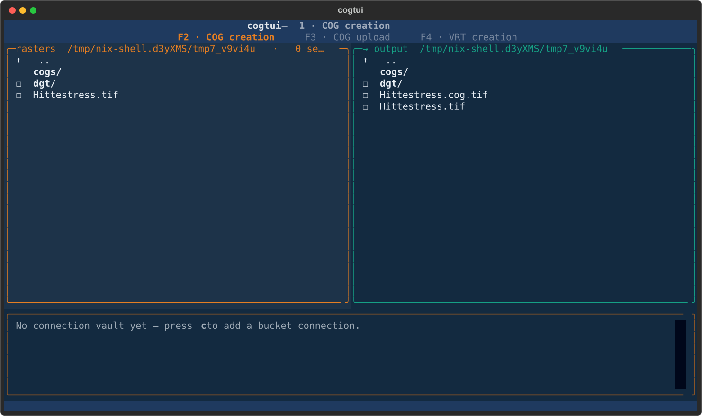

<!--
SPDX-FileCopyrightText: 2026 Kartoza (Pty) Ltd <info@kartoza.com>
SPDX-License-Identifier: MIT
-->

<p align="center">
  
</p>

<h1 align="center">geocog</h1>

<p align="center">
  <em>Turn GeoTIFFs into cloud-hosted COGs and publish them as one GeoServer layer —
  from a small, fast, keyboard-driven TUI.</em>
</p>

<p align="center">
  <a href="https://github.com/kartoza/geocog/actions/workflows/ci.yml"></a>
  <a href="https://github.com/kartoza/geocog/actions/workflows/docs.yml"></a>
  <a href="https://kartoza.github.io/geocog/"></a>
  <a href="LICENSE"></a>
  <a href="https://api.reuse.software/info/github.com/kartoza/geocog"></a>
  <a href="https://github.com/sponsors/kartoza"></a>
</p>

---

**geocog** takes ordinary GeoTIFFs, turns them into **Cloud Optimized GeoTIFFs
(COGs)**, uploads them to S3/MinIO, and wraps one or more cloud COGs in a single
small GDAL **VRT** that GeoServer can publish as one seamless layer. It ships as
the **`geocog`** TUI plus matching CLI tools, all sharing one engine. Everything
is provided by the local Nix flake — no globally installed GDAL and no ad-hoc
`nix shell` needed.



```bash
nix run .#geocog     # launch the TUI (Convert → Upload → VRT)
nix run .#docs       # serve the documentation site
```

📖 **Docs:** <https://kartoza.github.io/geocog/> — highlights:
[The TUI](docs/tui.md) · [CLI walkthrough](docs/dgt-cog-to-vrt.md) ·
[COGs & HTTP Range](docs/cog-range-requests.md) ·
[Administrator guide](docs/administrator.md).
A single-file **[PDF manual](https://kartoza.github.io/geocog/pdf/geocog.pdf)**
is rebuilt on every release.

## Install

| Method | Command |
|--------|---------|
| **Nix** (self-contained, recommended) | `nix run github:kartoza/geocog#geocog` |
| **pip / pipx** (needs `gdal` + `mc` on PATH) | `pipx install geocog` |
| **Linux packages** | `.deb`, `.rpm`, AppImage, Snap — see [Releases](https://github.com/kartoza/geocog/releases) |
| **Standalone binary** | download for Linux/macOS/Windows from [Releases](https://github.com/kartoza/geocog/releases) |

> Prerequisite for Nix: flakes enabled. If `nix run` complains, add
> `experimental-features = nix-command flakes` to `~/.config/nix/nix.conf`.

## The workflow

Two panes, three modes — **F2/F3/F4** to switch, **F5** to run:

1. **COG creation** — local rasters → internally-tiled, overview-bearing,
   DEFLATE-compressed COGs (`-of COG`, 512 px tiles, type-aware predictor).
2. **COG upload** — push COGs to a bucket via `mc`; returns object URLs.
3. **VRT creation** — wrap cloud COG(s) in one VRT that references the objects;
   console share links are rewritten to range-capable URLs.

Bucket credentials live in an **AES-GCM encrypted vault** (one master
passphrase, PBKDF2 600k), managed from the built-in connection manager (`c`).

The same steps are available as CLI apps:

```bash
nix run .#to-cog   -- Hittestress.tif                 # 1. raster -> COG
nix run .#upload   -- --public -p dgt dgt/*.cog.tif   # 2. COG -> bucket
nix run .#make-vrt -- -o mosaic.vrt https://host/bucket/a.cog.tif   # 3. -> VRT
```

## ⚠️ Range requests matter (COG + GeoServer)

A COG is only efficient if the hosting **endpoint** honours HTTP `Range`
requests. "COG" describes the *file* layout; Range support is a property of the
*server* — both must be true. Always target the S3 **API** host
(`api.minio.do.kartoza.com/<bucket>/<key>`, which returns `206` +
`Content-Range`), not the Console share link. Details:
[COGs & HTTP Range](docs/cog-range-requests.md).

## Development

```bash
nix develop                       # gdal + mc + python + QA tooling
pytest                            # run the test suite
pre-commit run --all-files        # ruff · reuse · gitleaks · codespell
make help                         # all convenience targets
```

See [CONTRIBUTING.md](CONTRIBUTING.md), [SPECIFICATION.md](SPECIFICATION.md),
and [PACKAGES.md](PACKAGES.md). Security reports: [SECURITY.md](SECURITY.md).

## License

MIT — see [LICENSE](LICENSE). The project is
[REUSE](https://reuse.software)-compliant; every source file carries an SPDX
header.

---

Made with 💗 by [Kartoza](https://kartoza.com) ·
[Donate!](https://github.com/sponsors/kartoza) ·
[GitHub](https://github.com/kartoza/geocog)
