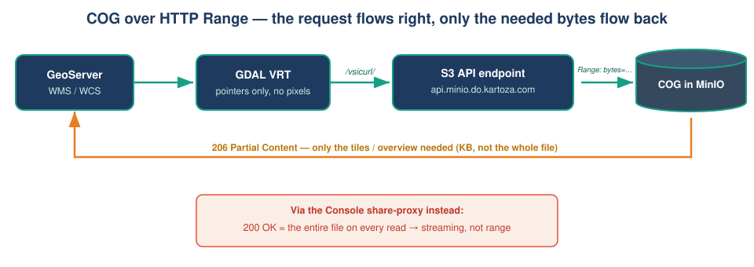

# Why COGs need HTTP Range — the technical workflow

This note explains *why* the pipeline is built the way it is, and in particular
why the **hosting endpoint must support HTTP Range requests** for a Cloud
Optimized GeoTIFF (COG) to be efficient. Get this wrong and every read
downloads the whole file ("streaming"), which quietly destroys GeoServer
performance.

## TL;DR

- **COG** is a property of the **file** (internal tiles + overviews + a header
  at the front). **Range support** is a property of the **HTTP server**.
  You need *both*.
- A range-capable server answers `Range: bytes=…` with **`206 Partial
  Content`**. GDAL then fetches only the few KB it needs for the requested
  window/zoom.
- A server that ignores Range answers **`200 OK`** with the **entire file**.
  GDAL has to pull all of it for every read — no better than a plain TIFF, and
  far worse over the network.
- On Kartoza's MinIO: use **`api.minio.do.kartoza.com`** (S3 API, `206`).
  Never the **console share link** on `minio.do.kartoza.com` (`200`, whole file,
  and it expires).

## What a COG actually is

An ordinary GeoTIFF can store rows in stripes and put its directory anywhere.
A COG imposes a cloud-friendly layout:

1. **Header/IFD first** — metadata and tile offsets sit at the start of the
   file, so a client learns the structure from one small read.
2. **Internal tiling** — pixels are stored as independent tiles (here 512×512),
   each at a known byte offset, so any map window maps to a small set of tiles.
3. **Overviews** — pre-computed lower-resolution copies, so a zoomed-out view
   reads a tiny overview instead of the full-resolution grid.

None of this helps unless the client can ask for **just those byte ranges**.

## How a client reads a COG over HTTP

```
1. GET header bytes            → tile index, overviews, georeferencing
2. Decide which tiles/overview cover the requested window & zoom
3. GET exactly those byte ranges   ← this is where Range is essential
4. Decode → pixels
```

With Range, step 3 is a handful of small `206` responses (KB–MB). Without it,
step 3 becomes "download the whole object" (tens of MB to GB) — repeated for
every tile GeoServer renders.

## Range vs streaming — the difference in one test

Ask any URL for the first 16 bytes and read the status line:

```bash
curl -sS -H 'Range: bytes=0-15' -o /dev/null -D - "$URL" \
  | grep -iE 'HTTP/|accept-ranges|content-range'
```

| Response | Meaning | COG behaviour |
|----------|---------|---------------|
| `206 Partial Content` + `Content-Range: bytes 0-15/…` | server honours Range | ✅ partial tile reads |
| `200 OK`, no `Content-Range` | server ignores Range, sends whole file | ❌ streams everything |

### Verified on this MinIO

| Endpoint | Result | Verdict |
|----------|--------|---------|
| `minio.do.kartoza.com/oauth_callback/api/v1/download-shared-object/<blob>` | HTML (Console SPA) | not the object |
| `minio.do.kartoza.com/api/v1/download-shared-object/<blob>` (share proxy) | `200`, whole 14 MB, ignores Range; blob expires | ❌ streaming, temporary |
| **`api.minio.do.kartoza.com/<bucket>/<key>`** (S3 API) | `206` + `Content-Range`, `image/tiff` | ✅ **use this** |

The file was a valid COG in *all* rows — only the endpoint changed the outcome.
That is the whole point: **the endpoint, not the file, decides streaming vs
range.**

## Where the VRT fits

A **VRT** is a few-KB XML file that references one or more sources and presents
them as a single raster. It stores **no pixels** — only pointers, the mosaic
geometry, CRS, band mapping and NoData.

```xml
<SourceFilename relativeToVRT="0">/vsicurl/https://api.minio.do.kartoza.com/tim-deleteme/dgt/…​.cog.tif</SourceFilename>
```

- Each source is a range-capable COG URL wrapped in `/vsicurl/`.
- `relativeToVRT="0"` (absolute) is required for remote sources — GeoServer
  can't resolve a relative path against an object store.
- Reads propagate down: GeoServer asks the VRT for a window → the VRT asks the
  relevant COG(s) → `/vsicurl/` issues ranged `206` GETs to the S3 API. Only the
  covering tiles of the covering source(s) move over the wire.

## The GDAL virtual file systems

| VSI prefix | Transport | Range? | Use it for |
|------------|-----------|--------|------------|
| `/vsicurl/` | plain HTTP(S) GET with `Range` | **required** | public / presigned COG URLs on a range-capable host |
| `/vsis3/` | S3 protocol (signed) | yes | private buckets, with credentials + `AWS_S3_ENDPOINT` |
| `/vsicurl_streaming/` | sequential whole-file GET | not needed | **test only** — endpoints without Range; downloads everything |

`make-vrt` uses `/vsicurl/` by default; `make-vrt -s` switches to
`/vsicurl_streaming/` for a quick check against a non-range endpoint (never for
production).

## Useful GDAL knobs (set by the scripts)

| Variable | Why |
|----------|-----|
| `GDAL_DISABLE_READDIR_ON_OPEN=EMPTY_DIR` | don't try to "list the directory" of an object store — saves failing requests |
| `CPL_VSIL_CURL_USE_HEAD=NO` | some endpoints don't answer `HEAD`; probe with a ranged `GET` instead |
| `GDAL_HTTP_MAX_RETRY` / `GDAL_HTTP_RETRY_DELAY` | ride out transient proxy hiccups |
| `CPL_CURL_VERBOSE=YES` | **debugging** — prints every HTTP request so you can confirm `206`s and see how many bytes move |

To *prove* range reads are happening, open the VRT with `CPL_CURL_VERBOSE=YES`
and watch for `Range:` request headers and `206` responses instead of one giant
transfer.

## End-to-end data flow



If the endpoint were the Console share-proxy, the return arrow would carry the
**whole file** on every request — streaming, not range reads.

## Checklist to avoid accidental streaming

- [ ] Source is a real COG (`gdalinfo` shows `LAYOUT=COG`, internal tiling,
      overviews). `to-cog` guarantees this.
- [ ] Hosting URL returns `206` to a `Range` probe (test with the curl above).
- [ ] URL is on the **S3 API host**, not the Console / share-proxy host.
- [ ] VRT sources are `/vsicurl/…` with `relativeToVRT="0"`.
- [ ] GeoServer has GDAL support (imageio-ext) with the COG + VRT drivers.

See [`dgt-cog-to-vrt.md`](dgt-cog-to-vrt.md) for the concrete, command-by-command
walkthrough of the DGT tiles.

---

Made with 💗 by [Kartoza](https://kartoza.com) | Donate! | GitHub
