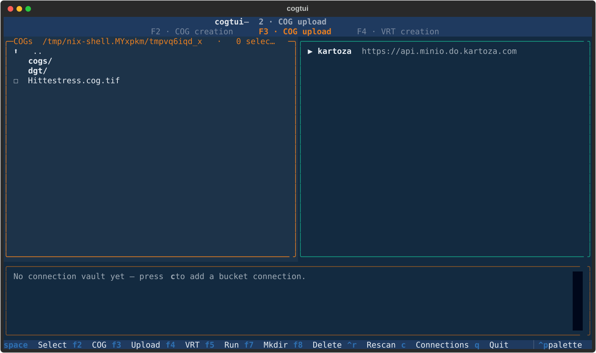
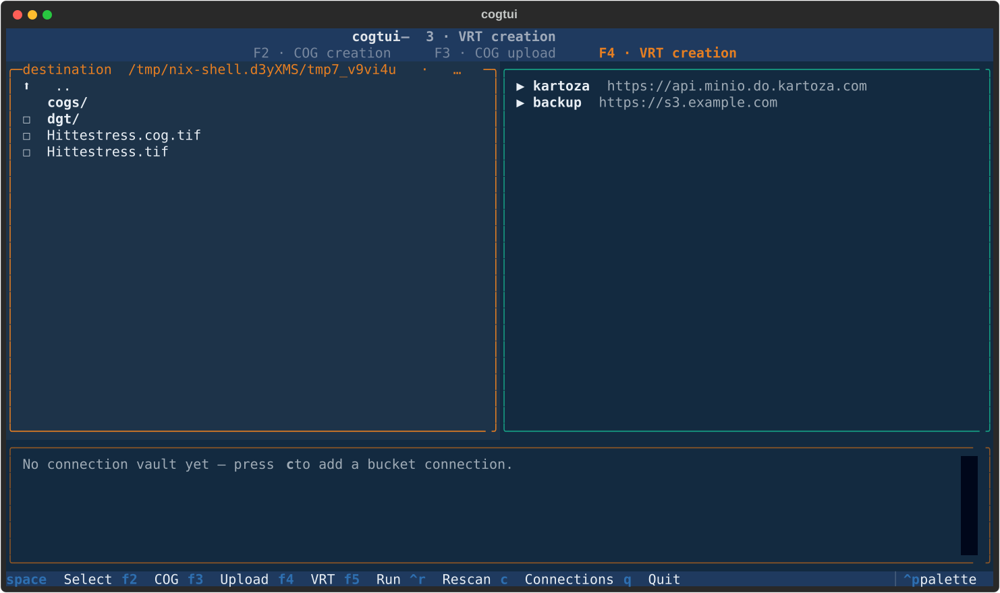

# The TUI

Launch it in the folder that holds your rasters:

```bash
nix run .#geocog
```

geocog is a **dual-pane** application (local files on the left, a destination or
S3 tree on the right) with **three modes**. It opens in *COG creation* mode.

## Keyboard

| Key | Action |
|-----|--------|
| `F2` / `F3` / `F4` | switch mode — COG creation / upload / VRT |
| `F5` | run the current mode's action |
| `Tab` | move focus between the left and right pane |
| `Enter` | open the highlighted folder / drill into a tree node |
| `Space` | select a file, or a whole folder (everything matching inside) |
| `Backspace` | go up a directory (left pane) |
| `F7` | make a directory in the focused pane |
| `F8` | delete the item under the cursor (asks to confirm) |
| `Ctrl+R` | rescan |
| `c` | open the connection manager |
| `q` | quit |

The focused pane is outlined in orange. **F7/F8 follow Midnight Commander** and
work on either side — local folders, or S3 buckets/folders/objects:

- **F7** in the local pane makes a folder in the current directory; in the S3
  pane it creates a **bucket** (on a connection node) or a **folder** (inside a
  bucket/folder).
- **F8** deletes the highlighted item after a confirmation — a local file/folder,
  or an S3 object (folders recurse, buckets are removed with `rb --force`).

## Mode 1 · COG creation

{ .shadow }

- **Left:** local raster GeoTIFFs (existing COGs are hidden).
- **Right:** navigate to the folder where the COGs should land.

Select rasters on the left (`Space` — or `Space` on a folder to take everything
inside), then **F5**. Each becomes a `NAME.cog.tif` in the right-pane folder:
internally tiled (512 px), overviews, DEFLATE, type-aware predictor.

## Mode 2 · COG upload

{ .shadow }

- **Left:** local `*.cog.tif` files.
- **Right:** a tree of your registered connections → buckets → folders. Expand a
  node with `Enter` (loaded lazily over `mc`).

Select COGs on the left, **highlight the destination bucket/folder** on the
right, then **F5** to upload. The resulting object URLs are printed in the log.

## Mode 3 · VRT creation

{ .shadow }

- **Left:** navigate to the destination folder for the `.vrt`.
- **Right:** the S3 tree; `Space` multi-selects COG files or whole folders
  (folders expand to every COG inside).

Press **F5**, name the VRT in the popover, and it's written into the left-pane
folder — a few-KB `.vrt` referencing the selected cloud COGs as one image, ready
for GeoServer. MinIO console share links pasted anywhere are auto-rewritten to
range-capable URLs.

## Connections & the vault

Press **`c`** to open the connection manager — add, edit, and delete bucket
connections (name, S3 API endpoint, access key, secret key). These become the
top-level nodes of the S3 tree in modes 2 and 3.

Credentials are stored in an **encrypted vault** at
`~/.config/geocog/connections.vault` (AES-GCM, key derived from a master
passphrase with PBKDF2). You set the passphrase the first time you save a
connection, and unlock the vault once per session.

!!! tip "Getting an access key"
    Signed in with Kartoza IdP/SSO? Create a persistent key in the MinIO Console
    under **Access Keys** and paste it into a connection. See the
    [CLI walkthrough](dgt-cog-to-vrt.md#step-0-get-an-access-key).

---

Made with 💗 by [Kartoza](https://kartoza.com) · Donate · [GitHub](https://github.com/kartoza/geocog)
